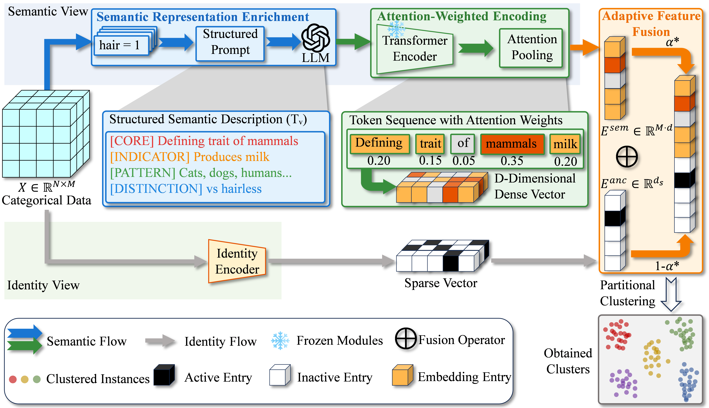

# ARISE: Attention-weighted Representation with Integrated Semantic Embeddings

Official implementation of **"Bridging the Semantic Gap for Categorical Data Clustering via Large Language Models"**.

## Overview

ARISE is a framework that integrates external semantic knowledge from Large Language Models (LLMs) into categorical data clustering. Unlike traditional methods that rely solely on within-dataset co-occurrence patterns, ARISE leverages LLM-derived semantics to bridge the semantic gap in categorical data representation.

<p align="center">
  
</p>

### Key Features

- **Semantie Representation Enrichment**: Queries LLMs at the attribute-value level for efficiency and consistency
- **Attention-weighted Encoding**: Emphasizes informative tokens in LLM-generated descriptions
- **Adaptive Feature Fusion**: Balances external semantic knowledge with data-specific patterns

## Installation

```bash
git clone https://github.com/develop-yang/ARISE.git
cd ARISE
pip install -r requirements.txt
```

## Quick Start

### 1. Prepare Data

```
ARISE/
├── datasets/
│   └── zoo/
│       └── zoo.data
├── examples/
│   └── gpt_Zoo.json
└── arise.py
```

### 2. Run

```bash
python arise.py
```

Or use in your code:

```python
from arise import ARISE, load_zoo_dataset, load_descriptions

features, labels, feature_names = load_zoo_dataset("./datasets/zoo/zoo.data")
descriptions = load_descriptions("./examples/gpt_Zoo.json")

arise = ARISE()
cluster_labels, best_alpha = arise.fit_predict(
    features=features,
    feature_names=feature_names,
    descriptions=descriptions,
    n_clusters=7
)
```

## Generate LLM Descriptions

Use prompts in `prompts/` directory to generate descriptions for your dataset. Output format:

```json
{
  "feature_value": "[CORE] ... [INDICATOR] ... [PATTERN] ... [DISTINCTION] ..."
}
```

## Repository Structure

```
ARISE/
├── arise.py              # Core algorithm
├── prompts/              # LLM prompt templates (8 datasets)
├── examples/             
│   └── gpt_Zoo.json      # Example descriptions
├── requirements.txt      
└── LICENSE
```

## Datasets

Datasets available from [UCI ML Repository](https://archive.ics.uci.edu/).

## Citation

```bibtex
@article{yang2025arise,
  title={Bridging the Semantic Gap for Categorical Data Clustering via Large Language Models},
  author={Yang, Zihua and Liao, Xin and Zhang, Yiqun and Cheung, Yiu-ming},
  year={2025}
}
```

## License

MIT License
